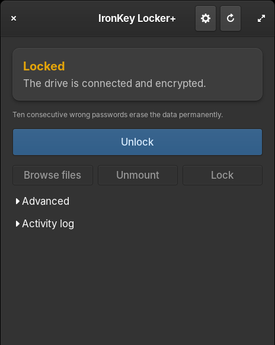

# IronKey Locker+ for Linux

A graphical application to set up and use a **Kingston IronKey Locker+ 50 G2**
encrypted USB drive on Linux — including the part no other tool could do:
**initializing a brand-new drive**.

Kingston ships software only for Windows and macOS. Existing community
projects can unlock a drive that was already set up elsewhere, but none of
them can perform the first-time setup. This one can, so a Linux-only user
never has to borrow a Windows machine.

<p align="center">
  
</p>

## Features

- **Initialize** a brand-new drive (set the first password) — no Windows needed
- **Unlock**, mount, unmount, and **lock again** without unplugging
- **Format** with a choice of exFAT, FAT32, NTFS, ext4 or Btrfs
- **Built-in file browser**: import, export, create folders, delete
- **Drive details**: capacity and free space, filesystem, serial number,
  firmware revision, USB link speed, write-protect state
- **Tools**: speed test, integrity check, filesystem check, firmware
  diagnostics, exportable report
- **Optional encrypted vault** to remember the drive password
  (scrypt + AES-256-GCM)
- Light / dark / follow-system appearance
- **Command-line interface** for SSH, scripts and headless machines
- **Carry the app on the drive**, with a SHA-256 manifest and a source
  check against your package manager before anything is copied
- Update checking against GitHub releases

## Requirements

- Python 3.8 or newer
- PyGObject with GTK 3 or GTK 4
- `pycryptodome` (for the device protocol)
- `cryptography` (only for the optional saved-password vault)
- `pkexec` (polkit) or `sudo`
- `udisks2` recommended — mounting then needs no password at all

Install the dependencies:

```bash
# Debian / Ubuntu / elementary / Mint
sudo apt install python3-gi gir1.2-gtk-3.0 python3-pycryptodome \
                 python3-cryptography udisks2 exfatprogs

# Fedora
sudo dnf install python3-gobject gtk3 python3-pycryptodome \
                 python3-cryptography udisks2 exfatprogs

# Arch
sudo pacman -S python-gobject gtk3 python-pycryptodome \
               python-cryptography udisks2 exfatprogs

# openSUSE
sudo zypper install python3-gobject gtk3 python3-pycryptodome \
                    python3-cryptography udisks2 exfatprogs
```

## Install

```bash
git clone https://github.com/SimuZSkyNeT/ironkey-linux-gui.git
cd ironkey-linux-gui
./install.sh              # current user only, no root needed
# or
sudo ./install.sh --system
```

Then launch **IronKey Locker+** from your applications menu, or run
`ironkey-gui`. The command-line tool is installed as `ironkey`.

**Debian, Ubuntu, Mint, elementary** can instead use the package from the
[releases page](https://github.com/SimuZSkyNeT/ironkey-linux-gui/releases):

```bash
sudo apt install ./ironkey-lockerplus_*.deb
```

To remove it: `./install.sh --uninstall`

## From the terminal

```bash
ironkey status          # is it connected, is it unlocked
ironkey unlock          # prompts for the drive password, then mounts
ironkey info            # serial, firmware, USB speed, free space
ironkey lock            # re-encrypt without unplugging
ironkey --help
```

Add `--json` to any command for machine-readable output. See
[docs/CLI.md](docs/CLI.md).

## How it works

The GUI runs **unprivileged**. Operations that need root (unlock, initialize,
format) go through a small helper invoked with `pkexec`, so you get your
desktop's normal authentication dialog. The drive password is never passed
as a command-line argument — it travels on the helper's standard input, so
it never appears in the process list.

Mounting and unmounting go through **udisks**, which needs no authentication
and makes the drive appear properly in your file manager.

## Two passwords, and which is which

| Prompt | What to type |
|---|---|
| A window from this app titled *Unlock IronKey* | the **drive** password you chose for the IronKey |
| The grey system dialog saying *Authentication is required* | your **computer** login password |

**Ten consecutive wrong drive passwords erase the data permanently.** This is
a hardware feature of the drive, not something this app can soften.

## Security notes

- The encryption is done by the drive's controller. The key never leaves the
  device, and this application never sees it.
- The optional vault protects only the *remembered copy* of your drive
  password. It does **not** add protection to the drive itself: anyone with
  access to your computer can unlock the drive with the command-line tool or
  with Kingston's own software. The app is not a gatekeeper and does not
  pretend to be one.
- Losing the drive password means losing the data. There is no recovery.

## Compatibility

Developed and tested on a **Locker+ 50 G2** (USB ID `0951:159d`) under
elementary OS 8. The protocol is shared across the Locker+ family, so other
capacities are likely to work, but they are untested. Reports welcome.

Not tested with: Vault Privacy 50, Keypad 200, or IronKey S200 — those are
different models with different protocols.

## Credits and provenance

- Unlock protocol and USB/HID transport:
  [wltechblog/ironkey-unlocker](https://github.com/wltechblog/ironkey-unlocker)
  (GPL-2), whose `ironkey_unlock.py` is bundled here under the same licence.
- Cross-checked against
  [DavidCarliez/ironkey-vp50](https://github.com/DavidCarliez/ironkey-vp50)
  and [meikster/ironkey-linux](https://github.com/meikster/ironkey-linux).
- The **initialization protocol** was reconstructed by analysing the vendor's
  own macOS application, which ships on the drive itself and retains its
  symbol table. Reverse engineering for interoperability is permitted in the
  EU under Directive 2009/24/EC, Article 6.

This project is **not affiliated with, endorsed by, or supported by Kingston
Technology**. IronKey is a trademark of its respective owner.

## Documentation

- [User guide](docs/USAGE.md) — every feature, in the order you need it
- [Command line](docs/CLI.md) — terminal usage and scripting
- [Troubleshooting](docs/TROUBLESHOOTING.md) — when something goes wrong
- [Architecture](docs/ARCHITECTURE.md) — how it is built, for contributors
- [Development](docs/DEVELOPMENT.md) — building, packaging and releasing
- [Changelog](CHANGELOG.md)

## Author

Made by **SimuZSkyNeT**.

The initialization protocol, the application, the packaging and the
documentation are original work. The unlock protocol is not — see Credits
above.

## Support the project

If this saved you from buying a Windows licence or borrowing a machine,
you can send something:

```
0x74E71BB8849FF0e17FA73Fc61DA107032D117dF6
```

ETH or any token, on Ethereum mainnet or any EVM-compatible chain
(Arbitrum, Optimism, Base, Polygon, BSC, Avalanche C-Chain and others).
Entirely optional — the software is free either way.

## Licence

GPL-2.0-only, inherited from the unlocker this builds on. See
[LICENSE](LICENSE).

## Warning

This software talks to an encrypted storage device at a low level. It has
been used successfully, but it is community software with no warranty. Keep
a backup of anything you care about — as you should with any storage device.
